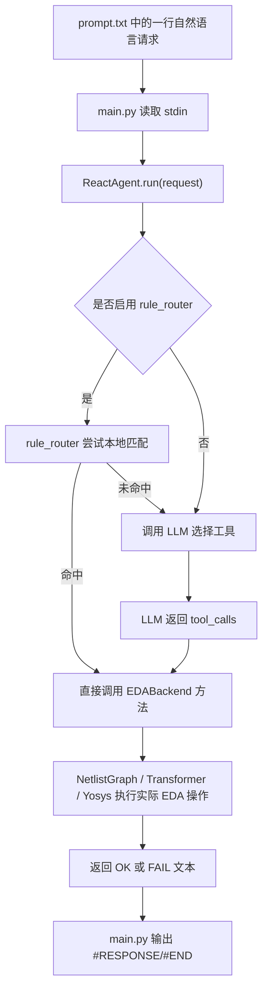

# ICCAD 2026 Problem A 项目技术报告

本文面向第一次接触本项目的人，解释当前系统要解决什么问题、整体架构是什么、每个模块具体负责什么、一次比赛测试请求如何被处理，以及最终如何验证结果是否满足比赛要求。

## 1. 项目目标

本项目是一个面向 ICCAD 2026 Problem A 的自然语言驱动 EDA 工具代理。比赛测试集会用自然语言描述一系列任务，例如：

- 读取某个 Verilog 网表文件。
- 查询 gate 数量、路径深度、fanout、fanin cone 等结构信息。
- 对网表做安全优化，例如删除 dangling gate、常量传播、结构合并、buffer 插入、逻辑门重映射。
- 将修改后的设计写回输出 Verilog。
- 检查输出设计是否仍然可被 EDA 工具读取，且不出现 multiple-driver 等结构错误。

因此，本项目的核心任务不是单纯“聊天回答问题”，而是把自然语言请求转换成确定的 EDA 操作，并在真实网表结构上完成分析和变换。

可以把它理解成一个三层系统：

```text
自然语言比赛请求
  -> Agent 层理解请求并选择工具
  -> EDA 后端执行网表分析/修改
  -> Yosys/Verilog 输出与测试脚本验证结果
```

当前项目支持两种运行方式：

- 默认模式：`config.yaml`，可以启用本地规则路由 `enable_rule_router: true`，对常见比赛模板请求直接走本地确定性解析。
- 纯 LLM 模式：`config.llm_only.yaml`，关闭规则路由 `enable_rule_router: false`，所有请求先由 LLM 判断应调用哪个工具。

最近一次完整验证使用的是纯 LLM 模式，结果为 100 个 release testcase 全部通过。

## 2. 项目目录结构

核心目录和文件如下：

```text
ICCAD2026-Competition/
  main.py
    比赛程序入口。读取 config，初始化后端和 agent，逐行处理 stdin 中的自然语言请求。

  config.py
    配置解析模块。读取 YAML，解析 LLM provider、API key、model、Yosys 路径、是否启用 rule_router。

  config.yaml
    默认配置。通常用于启用本地规则路由的模式。

  config.llm_only.yaml
    纯 LLM 配置。当前用于验证所有请求都通过 LLM 决策工具调用。

  agent/
    llm_client.py
      OpenAI/Anthropic 兼容客户端，负责真正调用大模型 API。

    react_agent.py
      Agent 主逻辑。接收请求，调用 LLM 或 rule_router，执行工具调用，返回标准化结果。

    rule_router.py
      本地规则路由器。使用正则和关键词把已知比赛请求映射为后端函数调用。

    tool_schema.py
      LLM 可调用工具列表与 system prompt。告诉模型有哪些 EDA 工具可以使用。

  eda/
    backend.py
      EDA 功能总入口。对 agent 暴露 read_design、write_design、gate_count、optimize 等高级 API。

    netlist_graph.py
      网表图结构。将 Yosys JSON 转为 Python 内存中的有向图。

    transformer.py
      网表结构修改器。执行删除、替换、buffer 插入、常量传播等图变换。

    writer.py
      Verilog 输出器。将修改后的 NetlistGraph 写回 gate-level Verilog。

    yosys_backend.py
      Yosys 封装。负责调用 Yosys 读取 Verilog、生成 JSON、执行优化和等价检查。

    optimizer.py
      cone 级优化逻辑。可以提取局部 cone，调用 Yosys/ABC 优化，再拼回原设计。

  scripts/
    run_release_tests.ps1
      批量测试脚本。对 100 个 release testcase 逐个运行，生成 summary.csv。

  docs/
    技术说明文档。

  run_outputs_llm_only_full4/
    当前纯 LLM 模式最终全量测试结果目录。
```

## 3. 一次请求的完整处理流程

比赛测试集中的每个 testcase 通常包含一个 `prompt.txt`。程序不是一次性读取整个 prompt，而是逐行读取，每一行都是一个独立请求。每处理一行，程序都必须输出：

```text
#RESPONSE n
...
#END n
```

评测器看到 `#END n` 后，才会继续发送下一条请求。

完整流程如下：



在纯 LLM 模式下，流程中的 rule_router 被关闭，因此每个实际请求都会进入 LLM 工具选择流程。LLM 不直接改 Verilog 文本，它只负责决定“该调用哪个工具、参数是什么”。真正的网表处理由本地 Python EDA 后端完成。

## 4. main.py：比赛入口和输出格式控制

`main.py` 的职责比较清晰：

1. 解析命令行参数 `-config`。
2. 使用 `config.py` 读取配置。
3. 初始化：
   - `YosysBackend`
   - `EDABackend`
   - `LLMClient`
   - `ReactAgent`
4. 从标准输入逐行读取比赛请求。
5. 每行请求调用 `agent.run()`。
6. 把回答包装为比赛要求的 `#RESPONSE n` 和 `#END n` 格式。
7. 同时把输出写入 testcase 对应的 `.log` 文件。

其中第一条请求通常是 testcase 初始化请求，例如：

```text
This is the beginning of a new testcase. The case name is test67.
```

程序会从这条请求中提取 case 名称，重置 agent 历史，并打开对应 log 文件。这样每个 testcase 的状态是隔离的。

## 5. 配置系统

项目通过 YAML 文件配置运行方式。常用字段包括：

```yaml
provider: "openai"

openai:
  api_key: "<YOUR_API_KEY>"
  base_url: "https://api2.aigcbest.top/v1"
  model: "gpt-4o-mini"

generation:
  temperature: 0.2
  max_output_tokens: 4096

yosys_bin: "C:/oss-cad-suite/bin/yosys.exe"
verbose: false
enable_rule_router: false
```

几个重要字段：

- `provider`：选择 OpenAI 或 Anthropic 风格 API。
- `api_key`：LLM API key。
- `base_url`：OpenAI 兼容网关地址。
- `model`：使用的模型名称。
- `yosys_bin`：Yosys 可执行文件路径。
- `enable_rule_router`：是否启用本地规则路由。

当前纯 LLM 全量测试使用 `config.llm_only.yaml`，其中 `enable_rule_router: false`。这意味着请求必须由 LLM 决定调用哪个 EDA 工具。

## 6. Agent 层：从自然语言到工具调用

Agent 层主要由三个文件组成：

- `agent/react_agent.py`
- `agent/llm_client.py`
- `agent/tool_schema.py`

### 6.1 ReactAgent

`ReactAgent` 是主控模块。它接收一条自然语言请求，返回一条标准化回答。

默认逻辑如下：

```text
如果 enable_rule_router = true:
  先尝试 route_request()
  如果本地规则命中，直接返回结果

否则或未命中:
  把请求加入 LLM history
  调用 LLMClient.chat()
  如果 LLM 返回 tool_calls:
    执行对应 EDABackend 方法
    把工具结果加入 history
    返回工具结果
  如果 LLM 返回普通文本:
    直接返回文本
```

当前代码还做了两个稳定性处理：

- LLM 请求失败时最多重试 5 次，降低临时 API 错误导致的 testcase 失败。
- 工具结果加入 LLM history 前会截断到较短长度，避免大测试集出现上下文超限；但完整结果仍然会输出到 stdout。

### 6.2 LLMClient

`LLMClient` 封装不同模型供应商的工具调用格式。OpenAI 和 Anthropic 的 tool-use 协议不同，但项目内部统一成：

```python
text, tool_calls = client.chat(messages, tools, system)
```

其中 `tool_calls` 的形态统一为：

```python
[
  {
    "id": "...",
    "name": "read_design",
    "arguments": {"path": "testcase/test01/test01.v"}
  }
]
```

这样 `ReactAgent` 不需要关心底层 API 差异，只需要根据 `name` 和 `arguments` 调用后端。

### 6.3 Tool Schema

`tool_schema.py` 定义 LLM 可以使用的所有工具，例如：

- `read_design`
- `write_design`
- `gate_count_breakdown`
- `get_max_depth`
- `find_path`
- `report_cone_size`
- `simplify_constant_gates`
- `replace_xor_with_nand`
- `replace_or_with_nand_not`
- `replace_xnor_with_nor`
- `buffer_high_fanout`
- `optimize_cone`
- `check_original_equiv`

这些工具本质上是 `EDABackend` 方法的外部接口说明。LLM 看到自然语言请求后，会选择一个或多个工具，并填入参数。

例如请求：

```text
Please load the design from testcase/test01/test01.v.
```

LLM 应调用：

```json
{
  "name": "read_design",
  "arguments": {
    "path": "testcase/test01/test01.v"
  }
}
```

## 7. EDA 后端：真正处理网表的地方

`eda/backend.py` 是 EDA 能力的统一入口。Agent 不直接接触 `NetlistGraph`、`Transformer` 或 Yosys，而是调用 `EDABackend` 的高级方法。

常见方法可以分为几类。

### 7.1 I/O 类

- `read_design(path)`：读取 Verilog，调用 Yosys 转 JSON，再构建内部图。
- `write_design(path)`：将当前图写回 Verilog。
- `design_summary()`：输出当前设计摘要。

### 7.2 结构分析类

- `gate_count_breakdown()`：按 gate 类型统计数量。
- `get_max_depth(from_signal, to_signal)`：计算两个信号之间最大组合深度。
- `find_path(from_signal, to_signal)`：寻找路径。
- `report_cone_size(output_signal)`：统计某个输出的 fanin cone 大小。
- `get_fanout(net_name)`：查询 fanout。
- `max_design_depth()`：计算整个设计最大组合深度。
- `deepest_output_cone()`：找最深输出 cone。

### 7.3 查询与验证类

- `primary_io_counts()`：统计输入输出端口数量。
- `list_primary_inputs_with_widths()`：列出输入端口宽度。
- `list_primary_outputs_with_widths()`：列出输出端口宽度。
- `same_clock_domain(ff1, ff2)`：判断触发器时钟域。
- `internal_signals_equiv(a, b)`：比较内部信号功能等价性。
- `boolean_expression(signal)`：生成某个信号的布尔表达式。

### 7.4 网表修改类

- `remove_dangling()`：删除不影响输出的无用 gate。
- `simplify_constant_gates()`：对常量输入 gate 做安全化简。
- `structural_duplicate_merge()`：合并结构重复的 gate。
- `collapse_not_not_pairs()`：折叠 NOT-NOT。
- `fuse_not_buf_pairs()`：去掉 NOT 后面的冗余 BUF。
- `buffer_high_fanout(net, max_fanout)`：对高 fanout 信号插入 buffer 树。
- `replace_xor_with_nand()`：把 XOR 映射成 NAND 网络。
- `replace_or_with_nand_not()`：用 NAND/NOT 实现 OR。
- `replace_xnor_with_nor()`：用 NOR 网络实现 XNOR。
- `optimize_cone(output_signal, max_depth)`：局部 cone 优化。

这些修改会改变内存中的 `NetlistGraph`。直到调用 `write_design()` 时，修改结果才会真正写成输出 Verilog 文件。

## 8. NetlistGraph：内部网表图模型

项目不会直接用字符串替换的方式修改 Verilog。它先把 Verilog 转成结构化图，再在图上做分析和变换。

整体转换路径为：

```text
Verilog
  -> Yosys read_verilog
  -> Yosys write_json
  -> NetlistGraph.from_yosys_json()
  -> Python 内存中的有向图
```

`NetlistGraph` 使用 cell-only 图模型。也就是说，图里主要有三类节点：

```text
PI 节点      primary input
CONST 节点   常量 0/1/x/z
CELL 节点    gate 或 DFF instance
```

边表示信号从一个 driver 流向一个 reader：

```text
PI:a -> U1(and) -> U2(or) -> output:y
```

项目没有把 wire 单独建成节点，而是把 wire 名称作为边和节点属性保存。这样做有几个好处：

- 图更小，遍历更快。
- 每个 gate 节点天然对应一个输出 wire。
- fanout 可以直接通过出边数量计算。
- 修改连接关系时更容易维护 driver/reader 关系。

为了避免结构错误，`NetlistGraph` 维护两个关键索引：

```text
wire_driver[wire]  = 谁驱动这根线
wire_readers[wire] = 哪些 gate 读取这根线
```

multiple-driver 问题本质上就是同一根 wire 被多个 cell 同时驱动。项目在变换和写出阶段都围绕这两个索引维护一致性。

## 9. Transformer：如何真正修改网表

`eda/transformer.py` 负责在 `NetlistGraph` 上做原地修改。它不调用 LLM，也不直接调用 Yosys。它只维护图结构：

- 添加节点。
- 删除节点。
- 添加边。
- 删除边。
- 修改 gate 类型。
- 重新连接输入输出。
- 更新 `wire_driver` 和 `wire_readers`。

### 9.1 删除 dangling gate

dangling gate 是指对任何 primary output 或有效 sequential state 都没有贡献的 gate。

算法思路：

1. 从所有 primary output driver 和 DFF 节点出发。
2. 沿反向边做可达性搜索。
3. 能被搜到的节点说明会影响输出或状态，需要保留。
4. 其他 cell 节点就是 dangling gate，可以删除。
5. 删除后继续迭代，直到没有新的 dangling gate。

### 9.2 常量传播

常量传播会识别安全的逻辑恒等式，例如：

```text
a AND 0 -> 0
a AND 1 -> a
a OR  1 -> 1
a OR  0 -> a
a XOR 0 -> a
a XOR 1 -> NOT a
NOT 0   -> 1
NOT 1   -> 0
```

当某个 gate 可以被输入信号或常量替代时，Transformer 会把它的所有后继重新连接到替代 driver，然后删除原 gate。

### 9.3 XOR 转 NAND

如果比赛要求把 XOR 变成 NAND 实现，项目使用标准 4-NAND 结构：

```text
t1 = nand(a, b)
t2 = nand(a, t1)
t3 = nand(b, t1)
y  = nand(t2, t3)
```

原 XOR gate 会被改成最后一级 NAND，同时新增 3 个 NAND gate 和若干内部 wire。

### 9.4 OR 转 NAND/NOT

根据 De Morgan 定律：

```text
a OR b = NAND(NOT a, NOT b)
```

所以转换时会新增两个 NOT，原 OR gate 改成 NAND。

### 9.5 高 fanout buffer 插入

如果某个信号驱动太多下游 gate，可能不符合 fanout 约束。项目会把原来的 load 分组，并插入 buffer 树：

```text
原来:
  src -> load1, load2, load3, load4, ...

修改后:
  src -> buf0 -> 一组 loads
  src -> buf1 -> 另一组 loads
```

这样可以降低单个 driver 的直接 fanout。

## 10. VerilogWriter：把图写回 Verilog

`eda/writer.py` 负责把修改后的图重新输出成 gate-level Verilog。

它做的事情包括：

1. 写 module 端口列表。
2. 写 input/output 声明。
3. 写内部 wire 声明。
4. 按拓扑顺序写 gate instance。
5. 对 DFF 使用 named-port 写法。
6. 对输出 alias 生成必要的 assign。
7. 对可能重复输出名的节点生成替代 wire，避免 multiple-driver。

输出的基本风格类似：

```verilog
module top (
    a,
    b,
    y
);
  input a;
  input b;
  output y;

  wire n1, n2;

  nand U1 (n1, a, b);
  not  U2 (n2, n1);
  buf  U3 (y, n2);

endmodule
```

VerilogWriter 的关键价值是：输出不是在原文件上拼字符串，而是从结构化图重新生成，因此更容易保证连接一致、声明完整、输出稳定。

## 11. Yosys 在项目中的作用

Yosys 是本项目依赖的开源 EDA 工具。它主要负责三件事。

### 11.1 读取 Verilog 并转 JSON

读取设计时，项目调用类似流程：

```text
read_verilog -sv input.v
hierarchy -check -top top
proc
flatten
write_json design.json
```

Yosys 把 Verilog 展平并转换为结构化 JSON。之后 Python 才能把它变成 `NetlistGraph`。

### 11.2 局部优化

对于 `optimize_cone()` 这类操作，项目可以提取一个 output 的 fanin cone，生成临时 Verilog，交给 Yosys/ABC 做逻辑优化，再把优化后的 cone 拼回原设计。

典型流程：

```text
提取 cone
  -> 生成 cone module
  -> ABC 优化
  -> 等价验证
  -> 拼回主图
```

### 11.3 输出验证

最终输出文件需要再次被 Yosys 读取。如果 Yosys 读不进去，说明 Verilog 格式、端口、wire、driver 关系等可能有问题。

最近一次最终验证对 100 个输出文件执行了类似流程：

```text
read_verilog -sv output.v
hierarchy -check -top top
proc
flatten
write_json temp.json
```

结果是 100/100 OK，未检测到 multiple-driver warning。

## 12. 本地规则路由与纯 LLM 模式的区别

项目有两种理解自然语言的路径。

### 12.1 本地规则路由

当 `enable_rule_router: true` 时，请求会先进入 `agent/rule_router.py`。这个模块使用正则表达式和关键词匹配常见比赛 prompt 模板。

例如：

```text
Please remove all dangling gates.
```

会被映射为：

```python
backend.remove_dangling()
```

它的优点是：

- 快。
- 稳定。
- 不消耗 token。
- 对已知比赛模板非常可靠。

限制是：

- 依赖已有规则覆盖。
- 如果隐藏测试换成非常陌生的说法，可能匹配不到。

### 12.2 纯 LLM 模式

当 `enable_rule_router: false` 时，请求不经过本地规则路由，而是交给 LLM 判断应调用哪个工具。

例如：

```text
Simplify gates with constant inputs without changing functionality.
```

LLM 应选择：

```json
{
  "name": "simplify_constant_gates",
  "arguments": {}
}
```

纯 LLM 模式更接近“真正自然语言工具代理”的工作方式，但也更依赖：

- tool schema 是否完整。
- system prompt 是否清楚。
- API 是否稳定。
- LLM 是否能选择正确工具。
- history 是否不会过长。

当前项目已经针对纯 LLM 模式做了补强，包括工具补齐、重试、history 压缩、错误分类和测试脚本增强。

## 13. 测试系统

全量测试脚本是：

```text
scripts/run_release_tests.ps1
```

常用运行方式：

```powershell
powershell -ExecutionPolicy Bypass -File .\scripts\run_release_tests.ps1 `
  -ReleaseRoot "E:\ICCAD\A_release testcase_0510-20260512T200851Z-3-001\A_release testcase_0510" `
  -Config config.llm_only.yaml `
  -OutDir run_outputs_llm_only_full4 `
  -CleanOutput
```

脚本对每个 testcase 做这些检查：

1. 找到 testcase 的 `prompt.txt`。
2. 启动 `python main.py -config ...`。
3. 把 prompt 逐行喂给程序。
4. 保存 stdout/stderr。
5. 检查进程是否超时或异常退出。
6. 检查 `#RESPONSE` 和 `#END` 数量是否与请求数量一致。
7. 检查是否出现 `FAIL[...]`、`UNKNOWN[...]`、Python Traceback、LLM API 错误、HTML 错误页等。
8. 对优化类请求检查是否真的产生优化效果，避免“空转但返回 OK”。
9. 生成 `summary.csv`。

最终结果中常见字段含义：

- `Status`：该 testcase 是否通过。`ok` 表示测试脚本层面通过。
- `FailureType`：失败类型，例如 `TIMEOUT`、`APP_RUNTIME`、`NO_OPT_EFFECT`。
- `Tokens`：该 testcase 消耗的 LLM token。
- `RequestCount`：prompt 中请求行数。
- `ResponseCount`：程序输出的 response 数量。
- `EndCount`：程序输出的 end 数量。
- `Complete`：请求数、response 数、end 数是否一致。
- `FailCount`：stdout 中 `FAIL[` 出现次数。
- `UnknownCount`：stdout 中 `UNKNOWN[` 出现次数。

## 14. 功能层面 OK 与全量成功的区别

这两个概念容易混淆。

### 14.1 功能层面 OK

功能层面 OK 通常表示程序流程没有崩：

- 请求有响应。
- 程序没有异常退出。
- 没有 Traceback。
- 输出文件能写出来。
- 没有明显 API 错误。

但这不一定说明比赛意义上成功。例如优化请求如果返回：

```text
OK: design unchanged
```

从程序运行角度看是 OK，但从比赛任务角度看可能失败，因为比赛要求做优化，空转不应算成功。

### 14.2 全量成功

当前项目采用更严格的全量成功定义：

- 100 个 testcase 都跑完。
- 每条请求都有完整 `#RESPONSE/#END`。
- 没有 `FAIL[...]`。
- 没有 `UNKNOWN[...]`。
- 没有 runtime error。
- 没有 LLM API error。
- 没有 timeout。
- 优化类请求不能无效果空转。
- 输出 Verilog 能被 Yosys 重新读入。
- 未检测到 multiple-driver warning。

因此，全量成功比“功能层面 OK”严格得多。

## 15. 当前最终测试结果

当前纯 LLM 模式最终全量测试目录：

```text
run_outputs_llm_only_full4/
```

核心结果：

```text
Release testcase 数量: 100
通过数量: 100
失败数量: 0
总请求数: 894
Fail 响应数: 0
总 token: 3,960,373
总耗时: 3058.79 秒，约 50.98 分钟
```

`summary.csv` 中 `Status` 分组结果：

```text
ok: 100
```

Yosys 输出验证结果：

```text
ok: 100
```

对应文件：

```text
run_outputs_llm_only_full4/summary.csv
run_outputs_llm_only_full4/yosys_validation.csv
```

这说明在当前 release testcase 上，项目的纯 LLM 工具调用路径已经可以完成 100/100 全量通过。

## 16. 完整例子一：读取设计并统计 gate 数量

### 16.1 输入请求

```text
Please load the design from the file test01.v located in the directory testcase/test01/.
Please count all the gates in this design and report the total count broken down by gate type.
```

### 16.2 Agent 选择工具

第一句调用：

```json
{
  "name": "read_design",
  "arguments": {
    "path": "testcase/test01/test01.v"
  }
}
```

第二句调用：

```json
{
  "name": "gate_count_breakdown",
  "arguments": {}
}
```

### 16.3 后端执行过程

读取设计时：

1. `EDABackend.read_design()` 接收路径。
2. `YosysBackend.verilog_to_json()` 调用 Yosys。
3. Yosys 输出临时 JSON。
4. `NetlistGraph.from_yosys_json()` 解析 JSON。
5. 后端保存当前设计图。

统计 gate 时：

1. 遍历图中所有 `cell` 节点。
2. 按 gate 类型分类。
3. 返回每类 gate 数量和总数。

### 16.4 是否修改设计

这个例子只是分析类请求，不修改网表。因此没有优化效果也不算失败。

## 17. 完整例子二：删除 dangling gate

### 17.1 输入请求

```text
Prune the netlist of unused gates. Make sure nothing changes functionally.
```

### 17.2 Agent 选择工具

```json
{
  "name": "remove_dangling",
  "arguments": {}
}
```

### 17.3 后端执行过程

1. 后端确认当前已经加载设计。
2. 调用 `NetlistTransformer.remove_dangling()`。
3. 从所有输出和 DFF 节点反向搜索。
4. 标记所有会影响输出或状态的节点。
5. 删除未被标记的 cell。
6. 更新图结构、wire driver、wire reader。
7. 记录删除数量。

### 17.4 输出结果

如果删除了 12 个 gate，回答会类似：

```text
OK: Removed 12 dangling gates.
```

如果一个优化类请求删除数量为 0，测试脚本会进一步判断这是否是合理情况。如果属于比赛要求必须优化的场景，空转会被判为 `NO_OPT_EFFECT`。

## 18. 完整例子三：常量传播优化

### 18.1 输入请求

```text
Simplify all gates with constant inputs without changing the design function.
```

### 18.2 Agent 选择工具

```json
{
  "name": "simplify_constant_gates",
  "arguments": {}
}
```

### 18.3 后端执行过程

Transformer 遍历所有 combinational gate，查找常量输入。例如：

```text
U1 = and(a, 1'b0)
```

可以化简为：

```text
U1_output = 1'b0
```

于是所有原来读取 `U1_output` 的后继 gate，会被重新连接到常量 0 节点。之后 `U1` 被删除。

另一个例子：

```text
U2 = xor(a, 1'b1)
```

可以重写为：

```text
U2 = not(a)
```

这类操作不改变功能，只减少或简化逻辑结构。

### 18.4 结果统计

后端会记录类似：

```text
constant_gates_eliminated: 8
```

测试脚本会把正数统计视为确实发生了优化。

## 19. 完整例子四：XOR 转 NAND 网络

### 19.1 输入请求

```text
Replace XOR gates with equivalent NAND-only implementations.
```

### 19.2 Agent 选择工具

```json
{
  "name": "replace_xor_with_nand",
  "arguments": {}
}
```

### 19.3 后端执行过程

假设原网表中有：

```verilog
xor U10 (y, a, b);
```

Transformer 会把它改造成等价 NAND 结构：

```text
t1 = nand(a, b)
t2 = nand(a, t1)
t3 = nand(b, t1)
y  = nand(t2, t3)
```

图层面发生的变化：

1. 新增 3 个 NAND cell。
2. 原 XOR cell 类型改为 NAND。
3. 新增内部 wire。
4. 重连原有输入输出关系。
5. 下游读取 `y` 的 gate 不需要知道内部实现发生了变化。

### 19.4 为什么这是安全的

这是一条固定布尔恒等式。只要输入是二值逻辑，4-NAND 结构与 XOR 功能等价。项目还会在输出阶段通过 Yosys 重新读取验证结构合法性。

## 20. multiple-driver 问题如何避免

multiple-driver 是指同一根 wire 被多个 gate 或 assign 同时驱动，例如：

```verilog
and U1 (n1, a, b);
or  U2 (n1, c, d);
```

这里 `n1` 同时被 `U1` 和 `U2` 驱动，是非法或危险结构。

项目通过几层机制降低这个风险：

1. `NetlistGraph` 维护 `wire_driver`，每根 wire 应只有一个 driver。
2. Transformer 添加新 wire 时使用 `_fresh_wire()`，避免重名。
3. 删除或替换 cell 时同步更新 reader 和 driver。
4. Writer 在发现重复输出 wire 时，为非 canonical driver 生成替代 wire。
5. 最终用 Yosys 重新读取输出文件，扫描 multiple-driver warning。

最近一次最终验证中，没有检测到 multiple-driver warning。

## 21. 当前项目的优势与边界

### 21.1 优势

- 真实修改结构化网表，而不是字符串替换。
- 支持 LLM 工具调用，也支持本地规则路由。
- EDA 操作集中在后端，模型只负责选择工具。
- 测试脚本能识别响应缺失、运行时错误、API 错误、空优化等问题。
- 输出经过 Yosys 二次验证。
- 当前 release 100 个 testcase 纯 LLM 模式全部通过。

### 21.2 边界

- 工具能力仍然由 `tool_schema.py` 和 `EDABackend` 暴露的函数决定。LLM 不能调用不存在的能力。
- 对隐藏测试中全新类型的任务，如果没有对应后端工具，LLM 也只能报告不支持。
- 纯 LLM 模式受 API 稳定性、上下文长度、模型工具选择准确率影响。
- 当前优化更多是结构安全优化和规则性重映射，不等价于完整商业综合器。
- Yosys 验证主要保证输出可读和结构合法；更强的功能等价检查需要针对具体修改场景调用 equivalence flow。

## 22. 如何复现实验结果

### 22.1 安装依赖

```powershell
python -m pip install -r requirements.txt
python -m pip install -r requirements-dev.txt
```

确保 Yosys 已安装，并在配置中设置：

```yaml
yosys_bin: "C:/oss-cad-suite/bin/yosys.exe"
```

### 22.2 设置 API

纯 LLM 模式修改：

```text
config.llm_only.yaml
```

默认模式修改：

```text
config.yaml
```

### 22.3 运行全量 release 测试

```powershell
powershell -ExecutionPolicy Bypass -File .\scripts\run_release_tests.ps1 `
  -ReleaseRoot "E:\ICCAD\A_release testcase_0510-20260512T200851Z-3-001\A_release testcase_0510" `
  -Config config.llm_only.yaml `
  -OutDir run_outputs_llm_only_full4 `
  -CleanOutput
```

### 22.4 查看结果

查看 testcase 汇总：

```powershell
Import-Csv .\run_outputs_llm_only_full4\summary.csv |
  Group-Object Status |
  Select-Object Name,Count
```

查看 Yosys 验证汇总：

```powershell
Import-Csv .\run_outputs_llm_only_full4\yosys_validation.csv |
  Group-Object status |
  Select-Object Name,Count
```

当前结果均为：

```text
ok: 100
```

## 23. 总结

当前项目实现的是一个自然语言驱动的 EDA 网表分析与优化系统。它的核心思路是：

```text
LLM 或 rule_router 负责理解请求
EDABackend 负责暴露稳定工具接口
NetlistGraph 负责结构化表示网表
Transformer 负责安全修改图
VerilogWriter 负责写回 Verilog
Yosys 负责读取、转换、优化和验证
测试脚本负责批量执行和失败分类
```

在当前 release 测试集上，纯 LLM 模式已经完成 100/100 全量通过，并通过 Yosys 对输出网表进行二次结构验证。对第一次接触项目的人来说，最重要的理解是：LLM 并不是直接生成最终 Verilog，而是在一组受控 EDA 工具中选择操作；真正的分析、优化和输出都发生在本地结构化网表后端中。
